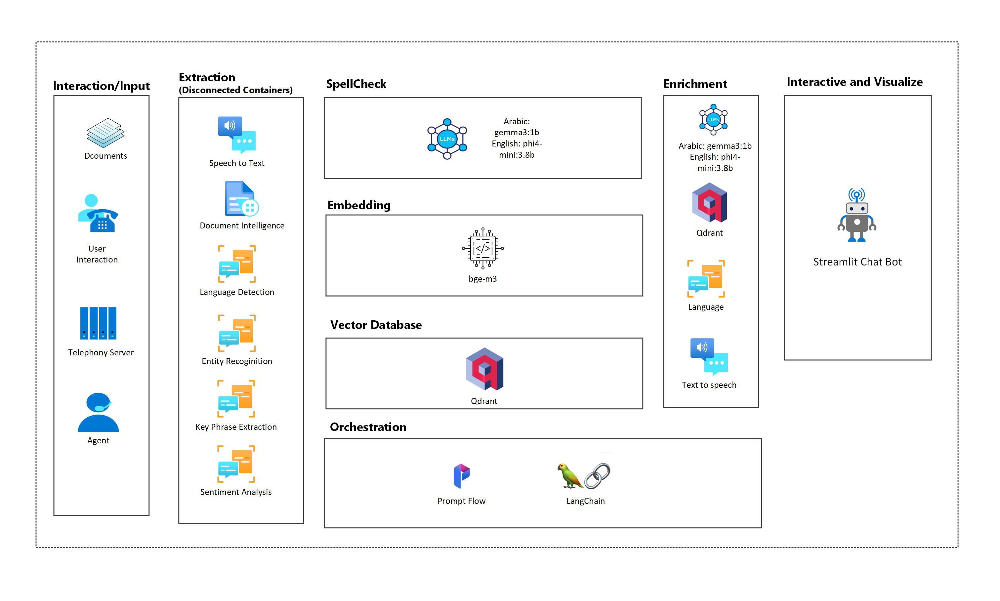

# On-Premises RAG solution powered by Azure AI Disconnected Containers 🔍  
**Deployable Offline | On-Premise | Any Cloud**  

This project delivers a **Retrieval-Augmented Generation (RAG) solution** architected for **enterprise-grade deployments**—offline, on-premises, or in private/public cloud environments.

Powered by **Azure AI Containers**, it ensures **high-performance retrieval, accuracy, and security**—whether running **fully offline, or in any cloud environment**.



## **Why This Matters?**

**Hybrid Retrieval**: Combines **Qdrant (vector search)**, **BM25 (keyword matching)**, and **Ollama embeddings** to enhance ranking and accuracy.  

**Multilingual AI**: Supports **Arabic & English** with optimized retrieval for short queries and complex prompts.  

**Azure AI Integration**: Leverages **Azure AI Containers** for ensuring **better accuracy, security, and usability**—even in offline environments.  

**On-Premise Ready**: Designed for **full offline deployment**, making it ideal for **customers needing secure, cloud-independent AI solutions**.  

---
## 🛠️ **Setup & Installation**  

### **1️⃣ Preinstalled Requirements**
Ensure you have the following installed before proceeding:
- **Python 3.9+** → [Download Here](https://www.python.org/downloads/)
- **Docker** → [Download Here](https://www.docker.com/get-started/)
- **Ollama** → [Install Guide](https://ollama.com)
- **Azure Document Intelligence (get a key first) Connected/Disconnected Containers (you can use connected containers as well as disconnected following same, Disconnected containers needs reservation)** → [Disconnected Containers](https://learn.microsoft.com/en-us/azure/ai-services/document-intelligence/containers/disconnected?view=doc-intel-4.0.0#document-intelligence-container-models-and-configuration)
- **Azure Language AI (get a key first) Connected/Disconnected Containers (you can use connected containers as well as disconnected following same, Disconnected containers needs reservation)** →[Azure Language Detection - Container Guide]( https://learn.microsoft.com/en-us/azure/ai-services/language-service/concepts/configure-containers)


# 🧠 Edge-RAG: On-Premises RAG with Azure AI + Ollama + Qdrant

This project implements a full-stack Retrieval-Augmented Generation (RAG) system that runs on-premises using **Azure AI Containers**, **Ollama**, and **Qdrant**. It supports both **English** and **Arabic** document ingestion and query responses via a **Streamlit UI**.

### **1️⃣ Clone the Repository**
```bash
git clone https://github.com/hamzaelgh/edge-rag.git
cd edge-rag
```

### **2️⃣ Create a `.env` File**
Create a `.env` file in the root directory with the following content:

```env
# Azure AI Language Connected Container
AZURE_LANGUAGE_ENDPOINT=https://yourAIlanguageService.cognitiveservices.azure.com/
AZURE_LANGUAGE_KEY=key

# Azure Document Intelligence Disconnected Container
AZURE_DOC_INTEL_ENDPOINT=https://yourDocumentIntelService.cognitiveservices.azure.com/
AZURE_DOC_INTEL_KEY=key

# Qdrant Configuration
QDRANT_HOST=localhost
QDRANT_PORT=6333
QDRANT_URL=http://localhost:6333
COLLECTION_NAME=documents

# Processing Configuration
EMBEDDING_SIZE=1024
CHUNK_SIZE=200
CHUNK_OVERLAP=50
BATCH_SIZE=100
MAX_RETRIES=3
RETRY_DELAY=1

# Model Configuration
EMBEDDING_MODEL=bge-m3
CACHE_EMBEDDINGS=true
CACHE_SIZE=10000

# Performance Configuration
MAX_WORKERS=4
EMBEDDING_TIMEOUT=30
```

</details>

### **3️⃣ Set Up Python Virtual Environment**
```bash
python3 -m venv venv
source venv/bin/activate  # macOS/Linux
venv\Scripts\activate     # Windows
```

### **4️⃣ Install Dependencies**
```bash
pip install -r requirements.txt
source .env 
```

### **5️⃣ Start Qdrant (Vector Database)**
Make sure **Docker** is installed, then run:
```bash
docker run -p 6333:6333 -p 6334:6334 qdrant/qdrant
```

### **6️⃣ Install & Run Ollama**
Follow Ollama installation from [Ollama's official website](https://ollama.com). Then, pull the required models:
```bash
ollama serve 
ollama pull qwen2.5:0.5b
ollama pull gemma2:2b
ollama pull bge-m3
ollama pull jaluma/arabert-all-nli-triplet-matryoshka:latest 
```

### **7️⃣ Run Azure AI Containers**

#### **Language Detection**
Run container:
```bash
docker run --rm -it --platform linux/amd64 -p 5000:5000 --memory 6g --cpus 2 \
  mcr.microsoft.com/azure-cognitive-services/textanalytics/language \
  Eula=accept \
  Billing="$AZURE_LANGUAGE_BILLING_URL" \
  ApiKey="$AZURE_LANGUAGE_API_KEY"
```

Test API:
```bash
curl -X POST "http://localhost:5000/text/analytics/v3.1/languages" \
     -H "Content-Type: application/json" \
     -d '{
          "documents": [
            {"id": "1", "text": "Hello, how are you?"},
            {"id": "2", "text": "مرحبا كيف حالك؟"}
          ]
        }'
```

📘 [Azure Language Detection Container Guide](https://learn.microsoft.com/en-us/azure/ai-services/language-service/language-detection/how-to/use-containers)

#### **Named Entity Recognition**
```bash 
docker run --rm -it -p 5000:5000 --memory 8g --cpus 1 \
mcr.microsoft.com/azure-cognitive-services/textanalytics/ner:latest \
Eula=accept \
Billing=${AZURE_LANGUAGE_BILLING_URL} \
ApiKey=${AZURE_LANGUAGE_KEY}
```

```bash 
curl -X POST "http://localhost:5000/text/analytics/v3.1/entities/recognition/general" \
     -H "Content-Type: application/json" \
     -H "Ocp-Apim-Subscription-Key: ${AZURE_LANGUAGE_KEY}" \
     -d '{"documents":[{"id":"1","text":"Microsoft was founded by Bill Gates and Paul Allen in 1975. The company is headquartered in Redmond, Washington."}]}'
```

### **8️⃣ Prepare & Index Documents**
Store your dataset inside the `data/` folder, then run:
```bash
python src/indexer.py
```

Check Qdrant Collections:
```bash
curl -X GET "http://localhost:6333/collections"
```

Clean Qdrant if needed:
```bash
curl -X DELETE "http://localhost:6333/collections/rag_docs_en"
curl -X DELETE "http://localhost:6333/collections/rag_docs_ar"
```

### **9️⃣ Start the Streamlit UI**
```bash
streamlit run src/app.py
```

### **🔟 Test Queries**
Open your browser at: [http://localhost:8501](http://localhost:8501)

Example Queries:
- **English:** `"What is artificial intelligence?"`  
- **Arabic:** `"ما هو الذكاء الاصطناعي؟"`


---

## 🔹 How Azure AI Containers Can Enhance your Offline RAG System
Azure AI Containers enable advanced AI capabilities while keeping the system **fully offline and on-premise-ready**. These services improve **document processing, query understanding, and response generation**, making the system **more accurate, secure, and scalable**.

| **Category**                          | **Azure AI Service**                                  | **Enhancement** |
|--------------------------------------|-----------------------------------------------------|----------------|
| **📄 Improving Document Processing & Indexing** | **Azure AI Vision - Read** | Extracts text from **scanned documents & images**, making PDFs and handwritten content searchable. |
|                                      | **Azure Document Intelligence** | Processes **structured documents** (e.g., invoices, contracts) before indexing, improving retrieval in legal and enterprise use cases. |
| **🔎 Enhancing Query Understanding & Retrieval** | **Azure AI Language** | Detects **query language** to route requests correctly. |
|                                      | **Conversational Language Understanding (CLU)** | Classifies **query intent** (e.g., search vs. summarization) for smarter responses. |
| **🤖 Enhancing AI-Generated Responses** | **Azure AI Sentiment Analysis** | Adjusts AI response **tone** (formal/casual) based on sentiment detection. |
|                                      | **Azure AI Text Translation** | Enables **cross-language retrieval** (e.g., Arabic query → English documents). |
|                                      | **Neural Text-to-Speech (TTS)** | Converts **AI responses into speech**, enabling chatbot and voice assistant integrations. |
| **🛡️ Ensuring Content Safety & Compliance** | **Azure AI Content Safety** | Scans **both text and images** for **violence, hate speech, self-harm, and explicit content**, ensuring AI-generated responses and retrieved documents comply with safety standards. |

🔹 **These integrations ensure the RAG system remains fully functional in offline environments while benefiting from enterprise-grade AI.**  

📌 **Learn More**: [Azure AI Containers](https://learn.microsoft.com/en-us/azure/ai-services/cognitive-services-container-support)  
📌 **Azure AI Content Safety**: [Content Safety Containers (Preview)](https://learn.microsoft.com/en-us/azure/ai-services/content-safety/how-to/containers/container-overview)  

---

## ✅ Enhanced User Flow with Azure AI Containers

| **Step** | **Tool Used** | **Description** |
|----------|-------------|----------------|
| **1. User enters or speaks a query** | Streamlit UI + **Azure AI Speech (Offline Container)** | Users can either type or speak their query. |
| **2. Spellcheck query** | **Bergamot (Local Spellchecker)** | Fixes typos before processing the query. |
| **3. Detect query language** | **Azure AI Language (Offline Container)** | Determines whether the query is in Arabic or English. |
| **4. Translate query (if needed)** | **Azure Translator (Optional)** | Converts non-Arabic/English queries into a supported language. |
| **5. Generate query embedding** | **Ollama (`bge-m3` for English & Arabic)** | Converts the query into a numerical vector representation. |
| **6. Retrieve relevant documents** | **Qdrant (Vector DB) + BM25 Hybrid Retrieval** | Performs a **hybrid search**: vector similarity search (embeddings) + keyword-based retrieval (BM25). |
| **7. Rank retrieved documents** | **BM25 (Rank-BM25) + `bge-m3` Reranking** | Ranks results based on **keyword relevance and vector similarity**. |
| **8. Extract named entities (Optional)** | **Azure AI NER (Offline Container)** | Identifies **key entities** in the query to improve retrieval precision. |
| **9. Apply OCR for document parsing** | **Azure Document Intelligence (Offline Container)** | Extracts text from **scanned PDFs, images, or structured documents** to improve knowledge base ingestion. |
| **10. Summarize long documents (Optional)** | **Azure Text Summarization (Offline Container)** | Summarizes **retrieved long documents** before passing them to the LLM. |
| **11. Generate an AI response** | **Ollama (`Qwen2.5` for English & `Gemma2B` for Arabic)** | Uses an **LLM** to generate an **answer using the top-ranked documents as context**. |
| **12. Apply content safety filters** | **Azure AI Content Safety (Offline Container)** | Ensures the **AI-generated response follows safety guidelines**, filtering out harmful or inappropriate content. |
| **13. Display response** | **Streamlit UI** | Shows **retrieved documents, scores, and the final AI response**. |

---
## 📌 **Addressing Arabic Language Challenges**

1️⃣ Challenge: Arabic Ranker Models**

**Problem:** Many ranker models struggle to reconstruct answers when the supporting information is scattered across multiple chunks.  
**Solution:** We integrate **BM25 + bge-m3 reranker**, which improves the ranking of relevant Arabic documents based on **semantic similarity and keyword matching**.

2️⃣ Challenge: Arabic Embedding Models**

**Problem:** Single-word Arabic queries sometimes fail to retrieve results, even when relevant content exists in the knowledge base.  
**Solution:** We use a **hybrid search approach**, combining:
   - **Vector search (Ollama embeddings)**
   - **BM25 keyword matching**
   - **Reranking using bge-m3**
   This ensures better retrieval even for **short Arabic queries**.


3️⃣ Mitigating those Issues** 

Our current implementation mitigates these issues with:
  - Hybrid Search (BM25 + Vectors)
  - Re-ranking (bge-m3)
  - Named Entity Recognition (NER)
  - LLM Context Expansion

4️⃣ Future Improvements
-  **Experiment with specialized Arabic embedding models** (e.g., Arabic-trained versions of BGE or ARABERT).  
-  **Optimize BM25 weights for Arabic vs. English separately** to fine-tune ranking balance.  
-  **Extend Named Entity Recognition (NER) to improve keyword-based lookup**.  
-  **Benchmark different Arabic language models for better retrieval performance**.

---
Enjoy building your **production-ready RAG system**! 🏗️🔥  
